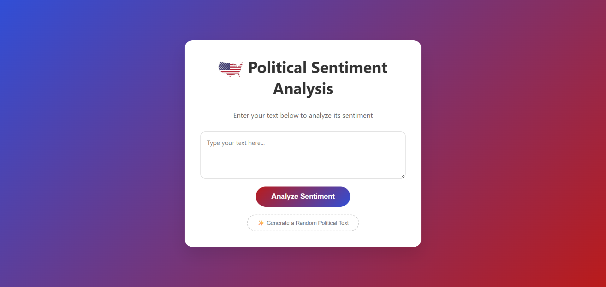
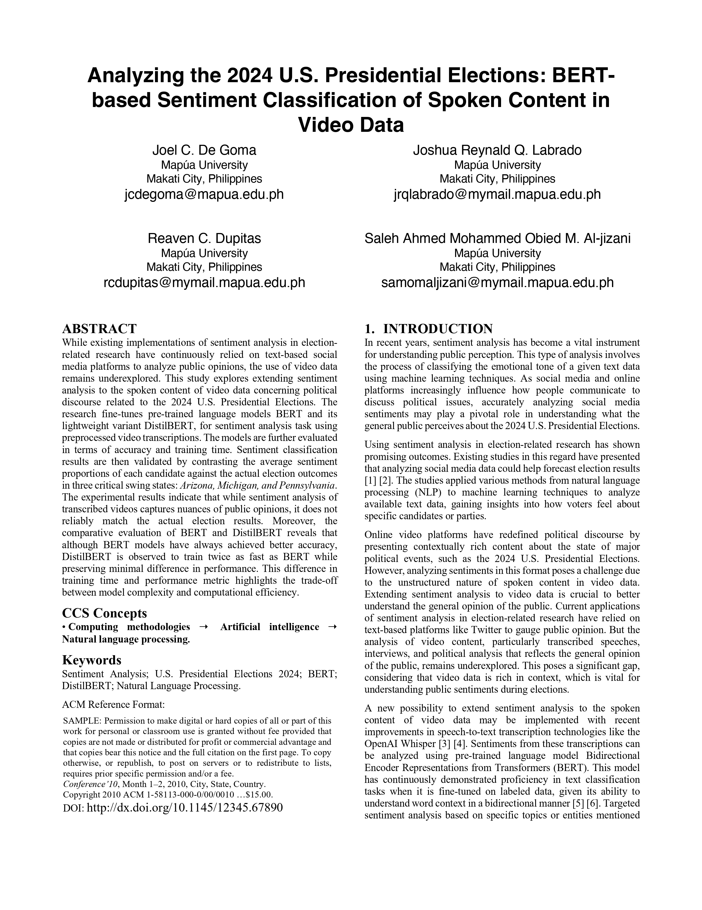
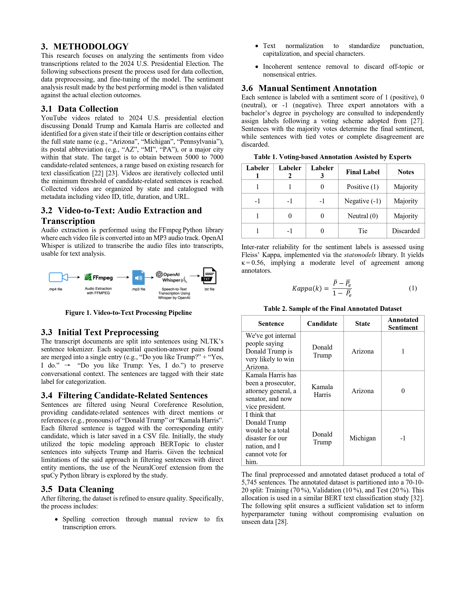
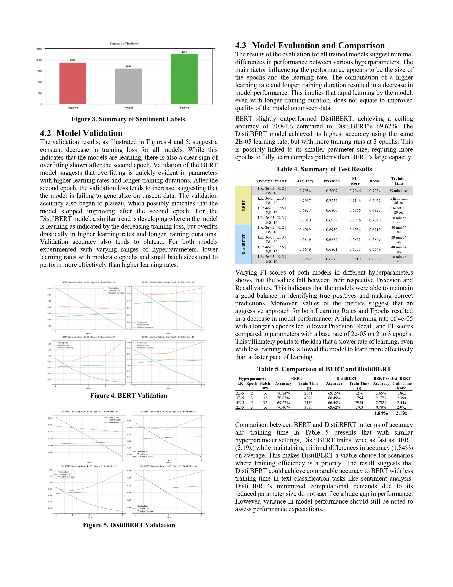
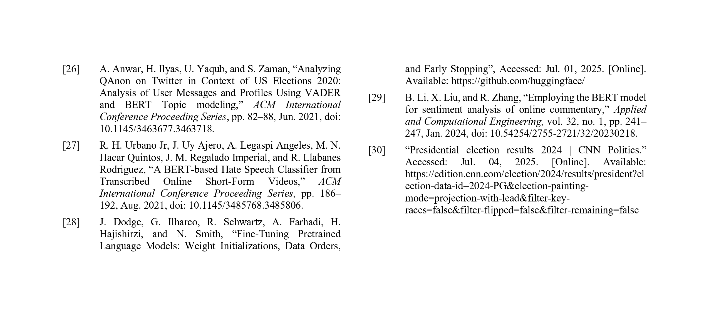

<div align="center">
  <h1 align="center">Political Sentiment Analysis System</h1>
  <div align="center">
    <a href="https://u-kuro-sentiment-predictor.hf.space">
      
    </a>
    <a href="https://huggingface.co/spaces/u-kuro/sentiment-predictor/tree/main">
      
    </a>
  <div align="center">
  </div>
    <a href="https://huggingface.co/u-kuro/sentiment-model">
      
    </a>
    <a href="https://drive.google.com/file/d/1YksitKdzOzZMULfgGYYfKn70nlC7ug1K/view?usp=sharing">
      
    </a>
  </div>
</div>

---

# What Is It

A production-ready sentiment analysis system trained on 2024 U.S. political discourse from YouTube videos. Built with BERT and deployed as a Flask web application on Hugging Face Spaces.

---

# 🖥️ Live Demo Preview
<a href="https://u-kuro-sentiment-predictor.hf.space" target="_blank"></a>

---

# 📄 Thesis Paper

<a href="https://drive.google.com/file/d/1YksitKdzOzZMULfgGYYfKn70nlC7ug1K/view?usp=sharing">
  
</a>
<br/>
<br/>
<details>
    <summary><b>📖 Show More</b></summary>
    <br/>
    <a href="https://drive.google.com/file/d/1YksitKdzOzZMULfgGYYfKn70nlC7ug1K/view?usp=sharing">
      
    </a>
    <a href="https://drive.google.com/file/d/1YksitKdzOzZMULfgGYYfKn70nlC7ug1K/view?usp=sharing">
      
    </a>
    <a href="https://drive.google.com/file/d/1YksitKdzOzZMULfgGYYfKn70nlC7ug1K/view?usp=sharing">
      
    </a>
    <a href="https://drive.google.com/file/d/1YksitKdzOzZMULfgGYYfKn70nlC7ug1K/view?usp=sharing">
      
    </a>
    <a href="https://drive.google.com/file/d/1YksitKdzOzZMULfgGYYfKn70nlC7ug1K/view?usp=sharing">
      
    </a>
    <a href="https://drive.google.com/file/d/1YksitKdzOzZMULfgGYYfKn70nlC7ug1K/view?usp=sharing">
      
    </a>
    <br/>
    <br/>
    <details>
        <summary><b>📖 Show Other References</b></summary>
        <br/>
        <a href="https://drive.google.com/file/d/1YksitKdzOzZMULfgGYYfKn70nlC7ug1K/view?usp=sharing">
          
        </a>
        <a href="https://drive.google.com/file/d/1YksitKdzOzZMULfgGYYfKn70nlC7ug1K/view?usp=sharing">
          
        </a>
    </details>
</details>

---

# 🛠️ Technical Stack

**Data Processing:**
- Youtube-Search-Python and PyTubeFix
- FFmpeg and OpenAI Whisper
- NLTK and spaCy (neuralcoref)

**Model Building:**
- Hugging Face Transformers (BERT, DistilBERT)
- Scikit-learn
- PyTorch

**Data Visualization:**
- Matplotlib and Seaborn
- WordCloud
- Pandas and NumPy

**Deployment:**
- Flask
- Docker
- Hugging Face Spaces

---

# 📂 Project Structure

```
├── 1) Data Collection/          # YouTube URL collection
├── 2) Video to Text Pipeline/   # Data transformation
├── 3) Text Preprocessing/       # Data cleaning and filtering
├── 4) Sentiment Annotation/     # Manual labeling and dataset creation
├── 5) BERT Models/              # Model training and evaluation
│   ├── BERT variants (4)
│   └── DistilBERT variants (4)
├── 6) Visualizations/           # Results visualization and analysis
└── Model-Prototype/web/         # Flask Web App
    ├── app.py
    ├── templates/
    └── static/
```
---

# 🔗 Quick Links

- **Try the Live App:** [u-kuro-sentiment-predictor.hf.space](https://u-kuro-sentiment-predictor.hf.space)
- **Browse App Source Code:** [huggingface.co/spaces](https://huggingface.co/spaces/u-kuro/sentiment-predictor/tree/main)
- **View the Model:** [huggingface.co](https://huggingface.co/u-kuro/sentiment-model)
- **Check the Thesis Paper:** [drive.google.com](https://drive.google.com/file/d/1YksitKdzOzZMULfgGYYfKn70nlC7ug1K/view?usp=sharing)
